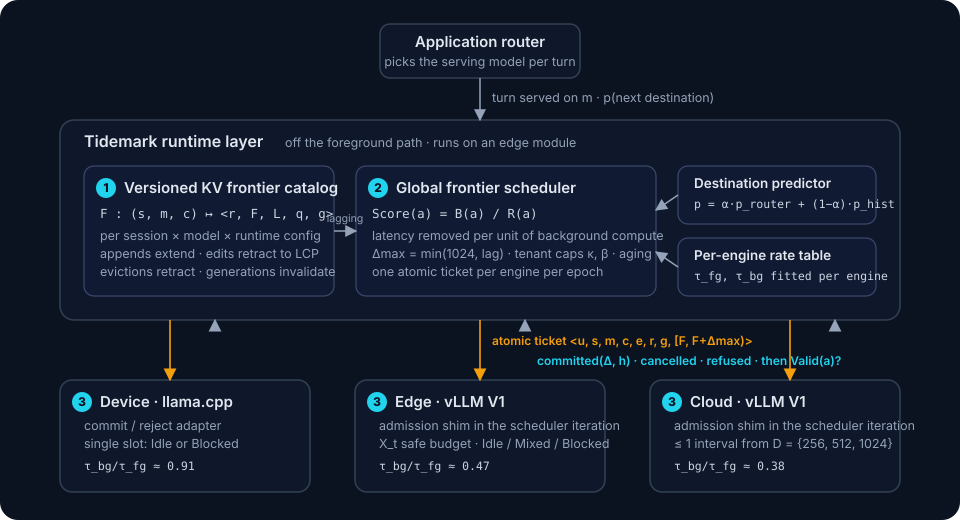

<p align="center">
  
</p>

<h3 align="center">Efficient model switching with versioned KV frontiers<br>for device–edge–cloud LLM serving</h3>

<p align="center">
  <a href=".github/workflows/ci.yml"></a>
  <a href="LICENSE"></a>
  
  
  
  
  <a href="https://github.com/astral-sh/ruff"></a>
</p>

<p align="center">
  <a href="#quick-start">Quick start</a> ·
  <a href="#how-it-works">How it works</a> ·
  <a href="#deploying-on-real-engines">Deploy</a> ·
  <a href="docs/architecture.md">Architecture</a> ·
  <a href="docs/configuration.md">Configuration</a> ·
  <a href="docs/faq.md">FAQ</a>
</p>

---

Mobile assistants increasingly serve one conversation across several models: a
small model on the phone, a mid-size model at the edge, a large model in the
cloud, with the router moving each turn between them as task difficulty, link
quality, energy and cost change. KV state does not follow the session. Every
model caches only the turns it served, so the models that are *not* serving fall
further behind the conversation with every turn, and the next switch pays for
the missing suffix on the critical path of the first token.

**Tidemark** is a runtime layer between the application router and the
inference engines of all tiers. It keeps the KV state of non-serving models
close to the conversation by spending the compute a decode-heavy batch leaves
idle on short, bounded prefill intervals for the models most likely to serve
next. It never touches the foreground path: a request still goes straight from
the router to its engine, and an engine is always free to refuse background
work.

<p align="center">
  
</p>

## Highlights

| | |
|---|---|
| **Versioned KV frontier catalog** | Tracks, for every `(session, model, runtime config)`, how far a reusable prefix has reached and which history revision it is valid against. Edits and evictions retract it; a generation number makes stale in-flight work harmless. |
| **Benefit-per-cost ranking** | Candidates across tenants and tiers are scored by the switch latency they would remove per millisecond of background compute, using prefill rates fitted per engine (a background token costs 0.38× a foreground token's time on the cloud GPU, 0.91× on a phone). |
| **Engine-local admission** | Each scheduler iteration serves foreground decode and prefill first, computes the safe budget that is left, and fits at most one interval from `{256, 512, 1024}` tokens into it, guarded by a 3 % bound on decode TPOT. |
| **Atomic tickets** | Progress commits in bounded intervals, so a short idle window produces durable state and a burst that cancels one interval does not discard the ones before it. |
| **Stock engines** | vLLM V1 with a ~120-line scheduler patch; llama.cpp with a small server patch. No second cache manager: committed state is found by the engine's ordinary prefix-cache lookup. |

On a physical device–edge–cloud testbed (three phones and boards, two Jetson AGX
Orin edge modules, a two-GPU cloud server) replaying WildChat and LMSYS
conversations under recorded wireless traces, Tidemark cuts **P95 model-switch
TTFT by up to 48.1 %** over prefix-caching and session-retention baselines,
holds cloud TPOT within its 3 % guard, and uses **68.3 % less speculative
compute** than whole-suffix prefetching at high load. Details are in the paper;
this repository contains the runtime, the engine patches, and a GPU-free replay
of the control loop.

## Quick start

### Sixty seconds, no GPU

```bash
git clone https://github.com/MrlixiangWE/Tidemark && cd Tidemark
pip install -e .
tidemark replay --trace examples/traces/demo.jsonl --load 0.6
```

The replay drives the real catalog, scheduler and admission code against a
synthetic mobility trace and the paper's fitted per-engine rates, and compares
three policies: reactive prefix caching, whole-suffix prefetch, and Tidemark.

```
policy         switches  p50_switch_ttft_ms  p95_switch_ttft_ms  cached_token_ratio  background_compute_s  tpot_inflation_ms  committed_intervals
-------------  --------  ------------------  ------------------  ------------------  --------------------  -----------------  -------------------
apc            98        599.3               3387.6              0.389               0.0                   0.0                0
full-prefetch  98        226.4               867.5               0.825               144.3                 38685.9            502
tidemark       98        234.4               883.5               0.81                109.45                0.0                780
```

Whole-suffix prefetch reaches a similar switch tail but pays for it in
foreground decode time; Tidemark gets there with bounded intervals that never
cross the guard. Raise `--load` to 0.9 and watch the difference widen.

### As a library

```python
from tidemark import TidemarkConfig, TidemarkRuntime
from tidemark.catalog.history import TokenizerRegistry
from tidemark.runtime.config import EngineConfig

config = TidemarkConfig(engines=[
    EngineConfig("edge-0",  "qwen2.5-7b",  "edge",  "http://edge:8000",  tau_fg_ms_per_ktok=732, tau_bg_ms_per_ktok=344, kv_bytes_per_token=57344),
    EngineConfig("cloud-0", "qwen2.5-14b", "cloud", "http://cloud:8000", tau_fg_ms_per_ktok=191, tau_bg_ms_per_ktok=73,  kv_bytes_per_token=98304),
])

tokenizers = TokenizerRegistry()          # one tokenizer per model: offsets are model-specific
tokenizers.register("qwen2.5-7b",  my_tokenizer_7b)
tokenizers.register("qwen2.5-14b", my_tokenizer_14b)

rt = TidemarkRuntime(config, tokenizers, router=my_router)   # router: destination probabilities per session
hist = rt.open_session("s1", tenant_id="alice")

hist.append("user", prompt)
# ... the application routes the turn to qwen2.5-7b and gets a reply ...
rt.turn_served("s1", model_id="qwen2.5-7b", resident_prefix=hist.length("qwen2.5-7b"))
# qwen2.5-14b is now lagging; the scheduler ranks it and issues a bounded ticket to cloud-0
```

`examples/quickstart.py` is a complete, runnable version of the above.

### Deploying on real engines

1. **Patch and start the engines.** Server tiers run vLLM with the admission
   shim, device tiers run llama.cpp with the commit patch:

   ```bash
   engines/vllm/install.sh                       # on each vLLM machine
   TIDEMARK_ENGINE_ID=cloud-2gpu TIDEMARK_SCHEDULER=http://edge:7420 \
     python -m vllm.entrypoints.openai.api_server --model Qwen/Qwen2.5-14B-Instruct \
       --enable-prefix-caching --scheduling-policy priority --port 8000
   ```

2. **Fit the rates** once per engine (about two minutes each):

   ```bash
   python scripts/calibrate_rates.py --config configs/testbed/device_edge_cloud.yaml --out configs/testbed/rates.yaml
   ```

3. **Run the scheduler** where it can see every tier; in our testbed that is
   one of the edge modules:

   ```bash
   tidemark serve -c configs/testbed/device_edge_cloud.yaml
   ```

4. **Report turns from your application** over the small HTTP API (or the
   Python API above). `examples/router_integration.py` shows the four calls it
   takes.

The deployment guides cover the details: [vLLM](docs/deployment/vllm.md),
[llama.cpp](docs/deployment/llamacpp.md), and [the testbed](docs/deployment/testbed.md).

## How it works

Tidemark has three parts, matching Sections 3.2–3.4 of the paper.

### ❶ Versioned KV frontier catalog

```
F : (s, m, c) ↦ ⟨r, F, L, q, g⟩
```

For each session and each compatible model, the committed prefix position `F`,
the revision `r` that produced it, its physical placement `L`, an in-flight
target `q`, and a generation `g`. A completed interval commits only if the
tokens it prefilled are still the history's tokens, nothing bumped the
generation since issue, and the interval continues the committed frontier
exactly:

```
Valid(a) = 1[h(H_a[0:F+Δ]) = h(H_s[0:F+Δ])] · 1[g_a = g] · 1[F_a = F]
```

Appends never invalidate a ticket; edits retract to the longest common prefix
and bump `g`. → [design note](docs/design/versioned-frontier.md)

### ❷ Global frontier scheduler

```
B(a) = p_{s,m} · [C_m(lag) − C_m(lag − Δ)]      expected switch latency removed
R(a) = τ_bg · Δ + λ_M · M_m(Δ)                  background compute + KV occupancy
Score(a) = B(a) / R(a)
```

Runs an epoch whenever a history grows or an engine changes state. Ranks
lagging frontiers by latency removed per unit of background compute, caps each
tenant at `κ` outstanding tickets and a `β` share of the aggregate budget, ages
tenants that keep losing, and issues at most one atomic ticket per engine.
→ [design note](docs/design/global-scheduler.md)

### ❸ Engine-local admission

```
X_t = max(0, min(B_t − D_t − P_t, X_max, X_t^KV))        safe budget of iteration t
Mode(t) = Idle | Mixed | Blocked                        Mixed requires TPOT_ewma ≤ (1+γ)·TPOT_ref
```

Foreground first. Then, if the decode-TPOT guard holds, fit the largest
interval from `{256, 512, 1024}` that is below both the ticket's `Δmax` and the
safe budget. Re-evaluated every scheduler iteration; a foreground arrival stops
the in-flight interval and it does not commit.
→ [design note](docs/design/engine-admission.md)

### Where it sits relative to existing mechanisms

| mechanism | scenario | state handling | managed object | policy |
|---|---|---|---|---|
| Prefix caching (vLLM-APC, SGLang) | cloud | preserve | cached blocks | hash-based block reuse |
| Session retention (Pensieve, AGServe, CachedAttention) | cloud | preserve | session KV state | cost-based eviction |
| Workflow prefetch (Parrot, KVFlow, PBKV) | cloud | prefetch | prefixes of explicit graph nodes | graph-based prefetch |
| Cross-model reuse (DroidSpeak, PrefillShare) | cloud–edge | preserve | shared prefix state | compatibility-based reuse |
| Whole-suffix prefetch (CE-CoLLM) | cloud–edge | prefetch | whole missing suffix | route-based prefetch |
| **Tidemark** | device–edge–cloud | **advance** | **versioned KV frontier** | **benefit-per-cost advance** |

Everything above either preserves state that foreground execution already
created or prefetches a workflow node or a whole suffix. None treats the
progress of a non-serving model as state that can be advanced, or estimates how
much latency an advance would remove.

## Repository layout

```
tidemark/
├── catalog/          versioned frontier catalog: history views, entries, validity predicate
├── scheduler/        atomic tickets, destination predictor, rate model, ranking epoch, global scheduler
├── admission/        safe budget, TPOT guard, three-mode controller, commit path
├── engines/
│   ├── vllm/         V1 scheduler shim, prefill-only request, token-id client
│   └── llamacpp/     commit/reject adapter for llama-server
├── router/           the small contract an application router implements
├── runtime/          config, service wiring, HTTP API, JSONL telemetry
├── sim/              GPU-free replay of the control loop
└── cli.py            tidemark serve | replay | inspect | rates
engines/
├── vllm/             tidemark_v1_admission.patch, install.sh
└── llamacpp/         tidemark_commit.patch
configs/              defaults, the paper's testbed, single-node and two-tier examples
scripts/              calibrate_rates.py, bench_switch_ttft.py, launch/stop engines, make_demo_trace.py
examples/             quickstart.py, router_integration.py, traces/demo.jsonl
docs/                 architecture, design notes, deployment guides, configuration, FAQ
tests/                unit tests for every component plus a replay smoke test
```

## Configuration

The defaults are the values the paper evaluates. Full reference in
[docs/configuration.md](docs/configuration.md).

| knob | default | what it does |
|---|---|---|
| `delta_max` | 1024 | largest interval a ticket may advance |
| `intervals` | `[256, 512, 1024]` | sizes an engine may admit |
| `gamma` | 0.03 | decode-TPOT guard tolerance |
| `alpha` | 1.0 | weight of the router signal vs. the history prior |
| `kappa` / `beta` | 2 / 0.35 | per-tenant outstanding tickets / share of background budget |
| `lambda_mem_ms_per_gib` | 64 | converts KV occupancy into compute-time units |
| `kv_headroom` | 0.08 | fraction of KV blocks the safe budget keeps free |

## The testbed

| tier | platform | model | engine |
|---|---|---|---|
| device | Galaxy S23+ (Snapdragon 8 Gen 2, 8 GB) | Llama-3.2-1B | llama.cpp |
| device | Jetson Orin NX (16 GB) | Phi-3.5-mini | llama.cpp |
| device | Raspberry Pi 5 (8 GB) | Gemma-3-1B | llama.cpp |
| edge | 2 × Jetson AGX Orin (64 GB) | Qwen2.5-7B | vLLM V1 |
| cloud | server, 2 × PCIe GPU (160 GB) | Qwen2.5-14B | vLLM V1 |

Devices reach the edge over a 100 Mbps wireless link. The models share no KV
state: every switch requires the destination to prefill what it is missing,
which is exactly the work Tidemark schedules. Fitted rates for all six engines
are in [`configs/testbed/rates.yaml`](configs/testbed/rates.yaml).

## Status

Tidemark is research software. The scheduler, catalog and admission code are
covered by unit tests and run without a GPU; the engine patches track vLLM
0.10.x and llama.cpp b6100 and are exercised on the testbed above. Things we
would like help with:

- adapters for SGLang and TensorRT-LLM (the interface is
  [`tidemark/engines/base.py`](tidemark/engines/base.py));
- rate measurements for hardware we do not have, especially other phone SoCs;
- a proper eviction callback from vLLM instead of inferring residency from
  `cached_tokens` after the fact.

See [CONTRIBUTING.md](CONTRIBUTING.md).

## Citation

```bibtex
@inproceedings{tidemark2027,
  title     = {Tidemark: Efficient Model Switching with Versioned KV Frontiers
               in Device-Edge-Cloud LLM Serving},
  author    = {Anonymous Authors},
  booktitle = {Proceedings of the 33rd Annual International Conference on
               Mobile Computing and Networking (MobiCom '27)},
  year      = {2027}
}
```

## License

Apache 2.0. See [LICENSE](LICENSE).

The vLLM patch is derived from and applies to code under the vLLM project's
Apache 2.0 license; the llama.cpp patch applies to code under llama.cpp's MIT
license. Neither patch is a fork; both are small overlays meant to be applied
on top of an upstream checkout.
